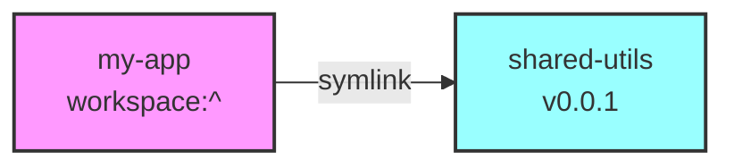
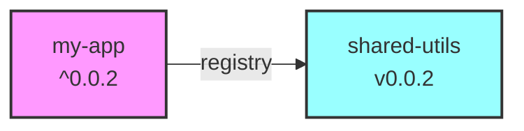

# Version Resolution Visual Examples

## Example 1: Simple Patch Update

### Before (Development)


### After `yarn changeset version` (Ready to Publish)


## Example 2: Major Version with Multiple Apps

### Initial State
```json
// shared-utils/package.json
{
  "name": "@yarn-workspaces-demo/shared-utils",
  "version": "1.5.3"
}

// app-stable/package.json
{
  "dependencies": {
    "@yarn-workspaces-demo/shared-utils": "workspace:~"
  }
}

// app-latest/package.json
{
  "dependencies": {
    "@yarn-workspaces-demo/shared-utils": "workspace:^"
  }
}
```

### After Major Version Bump (2.0.0)
```json
// shared-utils/package.json
{
  "name": "@yarn-workspaces-demo/shared-utils",
  "version": "2.0.0"  // Breaking change!
}

// app-stable/package.json
{
  "dependencies": {
    "@yarn-workspaces-demo/shared-utils": "~2.0.0"  // Only patch updates
  }
}

// app-latest/package.json
{
  "dependencies": {
    "@yarn-workspaces-demo/shared-utils": "^2.0.0"  // Minor updates OK
  }
}
```

## Example 3: Production Build Flow

### Development (Local Symlinks)
```
my-app/
  node_modules/
    @yarn-workspaces-demo/
      shared-utils -> ../../../../packages/shared-utils
```

### Production (`yarn workspaces focus --production`)
```
my-app/
  node_modules/
    @yarn-workspaces-demo/
      shared-utils/  # Actual package from registry
        package.json
        dist/
          index.js
          index.d.ts
```

## Example 4: Version Range Behaviors

| Scenario | workspace: | Current | After Patch | After Minor | After Major |
|----------|------------|---------|-------------|-------------|-------------|
| Conservative | `workspace:~` | 1.2.3 | ~1.2.4 | ~1.3.0 | ~2.0.0 |
| Standard | `workspace:^` | 1.2.3 | ^1.2.4 | ^1.3.0 | ^2.0.0 |
| Exact | `workspace:*` | 1.2.3 | 1.2.4 | 1.3.0 | 2.0.0 |

### What This Means:
- `~1.2.4` accepts: 1.2.4, 1.2.5, 1.2.6... (patches only)
- `^1.2.4` accepts: 1.2.4, 1.3.0, 1.9.9... (minor + patches)
- `1.2.4` accepts: 1.2.4 only (exact match)

## Example 5: Complete Publishing Timeline

```
Timeline                Action                          shared-utils    my-app dependency
────────────────────────────────────────────────────────────────────────────────────────
Development Start      Initial state                    0.1.0          workspace:^
     ↓
Add Feature           Create changeset (minor)          0.1.0          workspace:^
     ↓
Version              Run 'yarn changeset version'      0.2.0          ^0.2.0
     ↓
Build                Run 'yarn build'                  0.2.0          ^0.2.0
     ↓
Publish              Run 'yarn changeset publish'      0.2.0 ✓        ^0.2.0
     ↓
Post-Publish         Optionally revert to workspace    0.2.0          workspace:^
     ↓
Production Deploy    'yarn workspaces focus'           [from npm]     ^0.2.0
```

## Key Takeaways

1. **During Development**: `workspace:` = symlink to local code
2. **During Publishing**: `workspace:` → actual version range
3. **In Production**: Resolved versions fetch from registry
4. **Version Ranges Matter**: Choose based on stability needs
